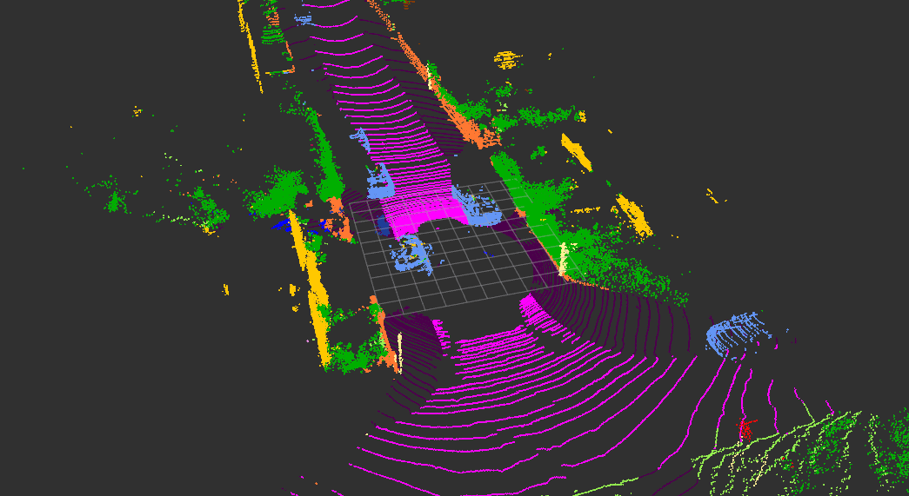

# RangeNetTrt8 for ROS2 Humble

[](LICENSE)

Deploy [RangeNetTrt8](https://github.com/Natsu-Akatsuki/RangeNetTrt8) on ROS2

## Prerequisites

### 1. [libtorch](https://pytorch.org/get-started/locally/)
tested on CUDA 11.7, libtorch 2.0.1

```diff
wget -c https://download.pytorch.org/libtorch/cu117/libtorch-cxx11-abi-shared-with-deps-2.0.1%2Bcu117.zip
$ unzip libtorch.zip
```

### 2. [TensorRT](https://developer.nvidia.com/tensorrt), [CUDA](https://developer.nvidia.com/cuda-toolkit), [cuDNN](https://developer.nvidia.com/cudnn)

| Ubuntu |           GPU           | TensorRT |      CUDA       |    cuDNN    |         —          |
|:------:|:-----------------------:|:--------:|:---------------:|:-----------:|:------------------:|
| 20.04  |        TITAN RTX        |  8.2.3   | CUDA 11.4.r11.4 | cuDNN 8.2.4 | :heavy_check_mark: |
| 20.04  | NVIDIA GeForce RTX 3060 | 8.4.1.5  | CUDA 11.3.r11.3 | cuDNN 8.0.5 | :heavy_check_mark: |
| 20.04 (test) | NVIDIA GeForce RTX 3070Ti  | 8.4.3.1  | CUDA 11.7.r11.7 | cuDNN 8.9.4.25 | :heavy_check_mark: |
| 22.04  | NVIDIA GeForce RTX 3060 | 8.2.5.1  | CUDA 11.3.r11.3 | cuDNN 8.8.0 | :heavy_check_mark: |
| 22.04  | NVIDIA GeForce RTX 3060 | 8.4.1.5  | CUDA 11.3.r11.3 | cuDNN 8.8.0 | :heavy_check_mark: |

> **Note**
>
> Tensorrt > 8.4 may have some running errors

### gedit ~/.bashrc

```diff
# CUDA
CUDA_PATH=/usr/local/cuda/bin
CUDA_LIB_PATH=/usr/local/cuda/lib64

# TensorRT
export LD_LIBRARY_PATH=${HOME}/TensorRT-8.4.3.1/lib:$LD_LIBRARY_PATH
export LIBRARY_PATH=${HOME}/TensorRT-8.4.3.1/lib::$LIBRARY_PATH

# libtorch
export Torch_DIR=${HOME}/libtorch/share/cmake/Torch
export LD_LIBRARY_PATH=${HOME}/libtorch/lib:$LD_LIBRARY_PATH
```

### 3. [ROS2(Humble)](https://docs.ros.org/en/humble/Installation.html)
> **Note**
>
> Debian packages for ROS 2 Humble Hawksbill are currently available for Ubuntu Jammy (22.04).  
> Source installation is available for Ubuntu Focal (20.04).  

### 4. other dependencies

```bash
sudo apt install build-essential python3-dev python3-pip apt-utils git cmake libboost-all-dev libyaml-cpp-dev libopencv-dev python3-empy
pip install catkin_tools trollius numpy
```

## Install

```diff
# mkdir -p ~/ros2_ws/src && cd ~/ros2_ws/src
git clone https://github.com/NeSC-IV/RangeNetTrt8
git clone https://github.com/ros2-gbp/pcl_msgs-release
cd pcl_msgs-release
git checkout release/humble/pcl_msgs
cd ..
git clone https://github.com/ros-perception/perception_pcl.git
cd perception_pcl
git checkout ros2
cd ../.. && colcon build --symlink-install
```

## Pretrained model [github](https://github.com/NeSC-IV/RangeNetTrt8/releases/download/v1.0/model.zip) | [百度云](https://pan.baidu.com/s/1iXSWaEfZsfpRps1yvqMOrA?pwd=9394)

### data structure

```bash
.
├── RangeNetTrt8
│   ├── model
│   │   ├── arch_cfg.yaml
│   │   ├── data_cfg.yaml
│   │   └── model.onnx
```


## Usage

The first run takes a while to generate the TensorRT optimization engine

<p align="center">
	
</p>

```bash
# >>> ROS2 >>>
cd ~/ros2_ws/
colcon build --symlink-install
source install/setup.bash
ros2 launch rangenet_pp ros2_rangenet.launch
ros2 launch rangenet_pp ros2_bag.launch
```

## FAQ

<details>
    <summary>:question: <b>问题 1：</b>
        [libprotobuf ERROR google/protobuf/text_format.cc:298] Error parsing text-format onnx2trt_onnx.ModelProto: 1:1:
    </summary>

1）情况一：下载的 ONNX 模型不完整，模型解析出问题。重新下载即可。

</details>

<details>
    <summary>:question: <b>问题 2：</b>
        TensorRT 从 8.2 升级到 8.4 时，预测结果异常，详见 <a href="https://github.com/Natsu-Akatsuki/RangeNetTrt8/issues/8">issue#8</a>
    </summary>

不对 235 层的模型权重不进行优化即可

</details>

<details>
    <summary>:question: <b>问题 3：</b>
        error: A __device__ variable cannot be marked constexpr        
    </summary>
CUDA 版本过低，需要升级 CUDA 版本（详见 [issue#4](https://github.com/Natsu-Akatsuki/RangeNetTrt8/issues/4)），若要保持较低的版本如 CUDA 11.1 则详见 [issue#2](https://github.com/Natsu-Akatsuki/RangeNetTrt8/issues/2)
</details>

